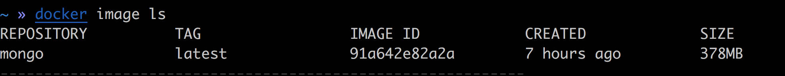
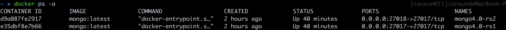
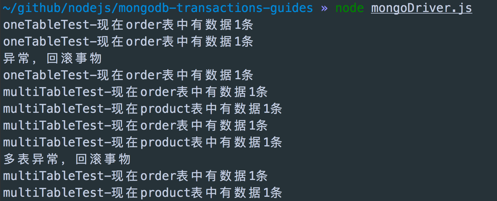
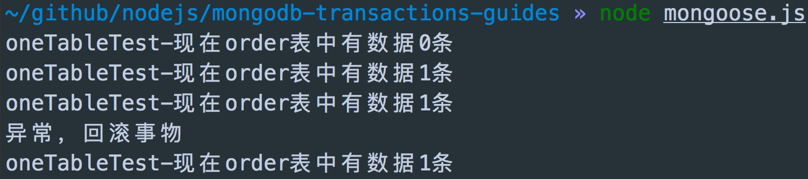

# MongoDB4.0事务采坑

## 版本

MongoDB server version: 4.0.0

## 限制

MongoDB有三种部署方式，分别是单实例、副本集和分布式部署。目前只有副本集支持事务，
所以只能现部署副本集的MongoDB集群了。

## 部署MongoDB副本集集群

在我的Mac已经安装3.x版本，为了不影响开发，我们使用`docker`部署。

### 下载官方docker镜像
> mongodb的docker hub地址：[https://hub.docker.com/_/mongo/](https://hub.docker.com/_/mongo/)

     docker pull mongo

在镜像文档里，我们知道了该镜像映射的端口号是`27017`，数据库文件的位置在`/data/db`。

### 查看下载的镜像

    docker image ls

### 创建数据存储目录

我们创建2个实例所以要创建2数据存储目录来映射`container`中的存储目录。

    mkdir -p ~/docker/mongo/db
    mkdir -p ~/docker/mongo/db1

### 启动镜像

一个映射到本地的`27017`端口，另一个映射到`27018`端口

    docker run -d -p 27017:27017 -v ~/docker/mongo/db:/data/db --name mongo4.0-rs1 mongo:latest --noprealloc --smallfiles --replSet rs2
    docker run -d -p 27018:27017 -v ~/docker/mongo/db1:/data/db --name mongo4.0-rs2 mongo:latest --noprealloc --smallfiles --replSet rs2

### 查看容器进程

    docker ps -a

### 副本集设置

    mongo
    rs.initiate()
    rs.add('192.168.31.93:27018');  //将另一个实例加入集群，注意这里不能写localhost

#### rs.add失败解决办法

错误如下

    rs.add("192.168.31.93:27017")
    {
        "ok" : 0,
        "errmsg" : "Either all host names in a replica set configuration must be localhost references, or none must be; found 1 out of 2",
        "code" : 103
    }

解决办法

    rs0:PRIMARY> var config=rs.config()
    rs0:PRIMARY> config.members[0].host="192.168.31.93:27017"
    192.168.31.93:27017
    rs0:PRIMARY> rs.reconfig(config)
    { "ok" : 1 }
    rs0:PRIMARY> rs.config()
    {
          "_id" : "rs0",
          "version" : 2,
          "protocolVersion" : NumberLong(1),
          "members" : [
                  {
                          "_id" : 0,
                          "host" : "192.168.31.93:27017",
                          "arbiterOnly" : false,
                          "buildIndexes" : true,
                          "hidden" : false,
                          "priority" : 1,
                          "tags" : {

                          },
                          "slaveDelay" : NumberLong(0),
                          "votes" : 1
                  }
          ],
          "settings" : {
                  "chainingAllowed" : true,
                  "heartbeatIntervalMillis" : 2000,
                  "heartbeatTimeoutSecs" : 10,
                  "electionTimeoutMillis" : 10000,
                  "getLastErrorModes" : {

                  },
                  "getLastErrorDefaults" : {
                          "w" : 1,
                          "wtimeout" : 0
                  },
                  "replicaSetId" : ObjectId("59ef0832a5da3378b1487f4e")
          }
    }
    rs0:PRIMARY>rs.add("192.168.31.93:27018")
    { "ok" : 1 }

## MongoDB Nodejs Driver Demo

> Nodejs mongodb库的版本 > 3.1.0

### 代码
    const {MongoClient} = require('mongodb');
    const uri = 'mongodb://192.168.31.93:27017,192.168.31.93:27018/mongo-tx';
    const oneTableTest = async () => {
        const client = await MongoClient.connect(uri, {useNewUrlParser: true, replicaSet: 'rs2'});
        const db = client.db();
        // 删除表内老数据
        await db.collection('order').deleteMany({});
        // 成功完成一个事务
        // 开启事务
        let session = client.startSession();
        await session.startTransaction();
        // 插入一条新数据
        await db.collection('order').insert({
            name: 'order1',
            total: 50
        }, {session});
        await session.commitTransaction();
        session.endSession();
        let count = await db.collection('order').countDocuments();
        console.log(`oneTableTest-现在order表中有数据${count}条`);
        // 事务回滚
        // 开启事务
        session = client.startSession();
        await session.startTransaction();
        try {
            // 插入一个正确的订单
            await db.collection('order').insert({
                name: 'order2',
                total: 100
            }, {session}); // 每次操作都得带上 session
            count = await db.collection('order').countDocuments();
            console.log(`oneTableTest-现在order表中有数据${count}条`);
            // 抛出一个异常
            throw new Error('订单异常');
        } catch (e) {
            // 有异常，终止事务
            console.log('异常，回滚事务');
            // 执行完成后，发现name为order2的订单 没有插入数据库
            await session.abortTransaction();
            session.endSession();
            count = await db.collection('order').countDocuments();
            console.log(`oneTableTest-现在order表中有数据${count}条`);
        }
    };

    const multiTableTest = async () => {
        const client = await MongoClient.connect(uri, {useNewUrlParser: true, replicaSet: 'rs2'});
        const db = client.db();
        // 删除表内老数据
        await db.collection('order').deleteMany({});
        await db.collection('product').deleteMany({});
        // 插入一条新数据
        await db.collection('order').insert({
            name: 'order1',
            total: 50
        });
        await db.collection('product').insert({
            name: 'product1',
            price: 50
        });
        let orderCount = await db.collection('order').countDocuments();
        console.log(`multiTableTest-现在order表中有数据${orderCount}条`);
        let productCount = await db.collection('product').countDocuments();
        console.log(`multiTableTest-现在product表中有数据${productCount}条`);
        // 开启事务
        const session = client.startSession();
        await session.startTransaction();
        try {
            // 插入一个正确的订单
            await db.collection('order').insert({
                name: 'order2',
                total: 100
            }, {session}); // 每次操作都得带上 session
            // 插入一个正确的商品
            await db.collection('product').insert({
                name: 'product2',
                price: 100
            }, {session}); // 每次操作都得带上 session
            orderCount = await db.collection('order').countDocuments();
            console.log(`multiTableTest-现在order表中有数据${orderCount}条`);
            productCount = await db.collection('product').countDocuments();
            console.log(`multiTableTest-现在product表中有数据${productCount}条`);
            // 抛出一个异常
            throw new Error('多表异常');
        } catch (e) {
            // 有异常，终止事务
            console.log('多表异常，回滚事务');
            // 执行完成后，发现name为order2的订单，name为product2的商品都没有插入数据库
            await session.abortTransaction();
            session.endSession();
            orderCount = await db.collection('order').countDocuments();
            console.log(`multiTableTest-现在order表中有数据${orderCount}条`);
            productCount = await db.collection('product').countDocuments();
            console.log(`multiTableTest-现在product表中有数据${productCount}条`);
        }
    };

    const main = async () => {
        await oneTableTest();
        await multiTableTest();
    };

    main().then();

### 结果

由结果看`多表`和`单表`事务都是支持的，且事务未结束前，出于事务中的操作是不会真实入库的。

## Mongoose Demo

> mongoose库的版本 > 5.2.0

### 代码

    const mongoose = require('mongoose');
    const uri = 'mongodb://192.168.31.93:27017,192.168.31.93:27018/mongo-tx';
    const oneTableTest = async () => {
        await mongoose.connect(uri, { useNewUrlParser: true, replicaSet: 'rs2' });
        const Order = mongoose.model('Order', new mongoose.Schema({
            name: String,
            total: Number
        }));
        await Order.remove({});
        let count = await Order.countDocuments({});
        console.log(`oneTableTest-现在order表中有数据${count}条`);
        // 正常事务
        let session = await mongoose.startSession();
        await session.startTransaction();
        await Order.create({
            name: 'order3',
            total: 150
        });
        await session.commitTransaction();
        session.endSession();
        count = await Order.countDocuments({});
        console.log(`oneTableTest-现在order表中有数据${count}条`);
        // 事务回滚
        session = await mongoose.startSession();
        await session.startTransaction();
        try {
            // 这种写法不行 create方法不接收 options参数,如果要接收options参数，第一参数必须为Array
            // 见文档 http://mongoosejs.com/docs/api.html#create_create
            // await Order.create({
            //     name: 'order4',
            //     total: 200
            // }, {session});
            // 这种写法可以
            // await Order({
            //     name: 'order4',
            //     total: 200
            // }).save({session});
            // 这种写法也可以
            await Order.create([{
                name: 'order4',
                total: 200
            }], {session});
            count = await Order.countDocuments({});
            console.log(`oneTableTest-现在order表中有数据${count}条`);
            // 抛出一个异常
            throw new Error('订单异常');
        } catch (e) {
            // 有异常，终止事务
            console.log('异常，回滚事务');
            await session.abortTransaction();
            session.endSession();
            count = await Order.countDocuments();
            console.log(`oneTableTest-现在order表中有数据${count}条`);
        }
    };

    oneTableTest().then();

### 结果

此例子没有测试多表，结果和上面的测试一样，只是不同的驱动。

