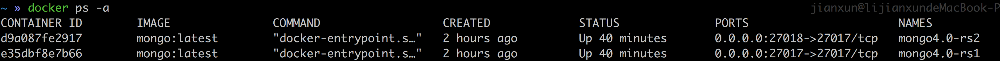

# 使用Docker构建MongoDB副本集

### 下载官方docker镜像
> mongodb的docker hub地址：[https://hub.docker.com/_/mongo/](https://hub.docker.com/_/mongo/)

     docker pull mongo

在镜像文档里，我们知道了该镜像映射的端口号是`27017`，数据库文件的位置在`/data/db`。

### 查看下载的镜像

    docker image ls

### 创建数据存储目录

我们创建2个实例所以要创建2数据存储目录来映射`container`中的存储目录。

    mkdir -p ~/docker/mongo/db
    mkdir -p ~/docker/mongo/db1

### 启动镜像

一个映射到本地的`27017`端口，另一个映射到`27018`端口

    docker run -d -p 27017:27017 -v ~/docker/mongo/db:/data/db --name mongo4.0-rs1 mongo:latest --noprealloc --smallfiles --replSet rs2
    docker run -d -p 27018:27017 -v ~/docker/mongo/db1:/data/db --name mongo4.0-rs2 mongo:latest --noprealloc --smallfiles --replSet rs2

### 查看容器进程

    docker ps -a

### 副本集设置

    mongo
    rs.initiate()
    rs.add('192.168.31.93:27018');  //将另一个实例加入集群，注意这里不能写localhost

#### rs.add失败解决办法

错误如下

    rs.add("192.168.31.93:27017")
    {
        "ok" : 0,
        "errmsg" : "Either all host names in a replica set configuration must be localhost references, or none must be; found 1 out of 2",
        "code" : 103
    }

解决办法

    rs0:PRIMARY> var config=rs.config()
    rs0:PRIMARY> config.members[0].host="192.168.31.93:27017"
    192.168.31.93:27017
    rs0:PRIMARY> rs.reconfig(config)
    { "ok" : 1 }
    rs0:PRIMARY> rs.config()
    {
          "_id" : "rs0",
          "version" : 2,
          "protocolVersion" : NumberLong(1),
          "members" : [
                  {
                          "_id" : 0,
                          "host" : "192.168.31.93:27017",
                          "arbiterOnly" : false,
                          "buildIndexes" : true,
                          "hidden" : false,
                          "priority" : 1,
                          "tags" : {

                          },
                          "slaveDelay" : NumberLong(0),
                          "votes" : 1
                  }
          ],
          "settings" : {
                  "chainingAllowed" : true,
                  "heartbeatIntervalMillis" : 2000,
                  "heartbeatTimeoutSecs" : 10,
                  "electionTimeoutMillis" : 10000,
                  "getLastErrorModes" : {

                  },
                  "getLastErrorDefaults" : {
                          "w" : 1,
                          "wtimeout" : 0
                  },
                  "replicaSetId" : ObjectId("59ef0832a5da3378b1487f4e")
          }
    }
    rs0:PRIMARY>rs.add("192.168.31.93:27018")
    { "ok" : 1 }

